# TopProfessor

## Description
- Through RateMyProf, students would be able to rate their teachers based off their experiences in class. Their class schedules could also be viewed to provide better clarity for the students
- Faculty would be able to view their score/ratings. Administrators/Cluster Department Chairs would also get to view the statistical ratings of their faculty to provide better insight on how to further the academic experience of students and teachers alike.

## Benefits brought by the Platform

- The full-stack web application greatly benefits its benefactors by providing convenient access to professor ratings and class schedules, enabling informed decision-making in course selection and academic planning. Through transparent feedback from students, the platform fosters accountability among professors, encouraging them to maintain high teaching standards. Administrators and department chairs can leverage the platform's statistical data to gain valuable insights into teaching effectiveness and student satisfaction, facilitating data-driven decision-making. Additionally, the platform promotes community engagement by facilitating communication between stakeholders and empowering students to have a voice in their educational experience. Overall, the application streamlines administrative tasks, promotes transparency, and empowers stakeholders, ultimately enhancing the quality of the academic experience.

## Diagram

## Libraries Used:
- **React**
- **Django Rest Framework**
- **React Router**
- **TailwindCSS**
- **Jest**

## Pictures of the appliation

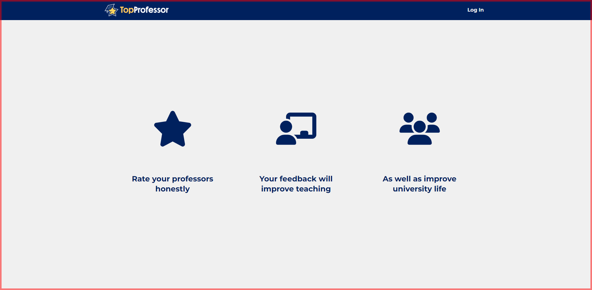
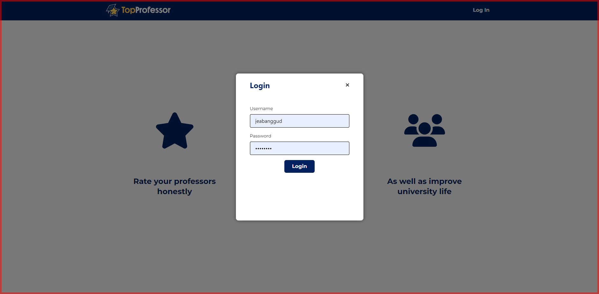
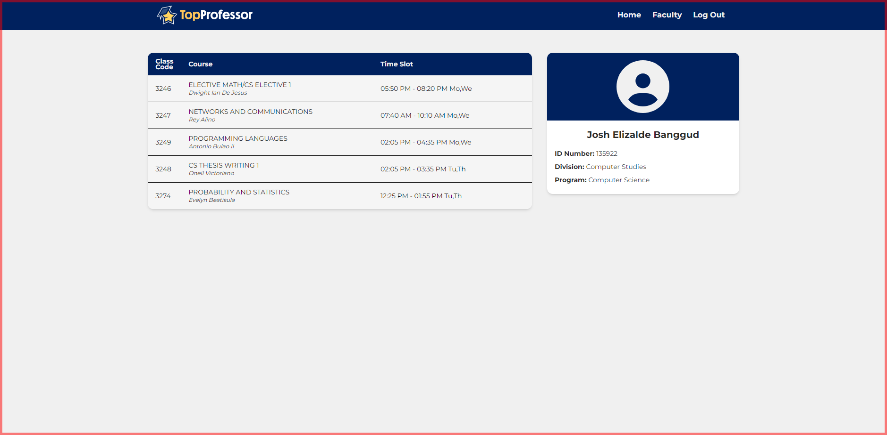
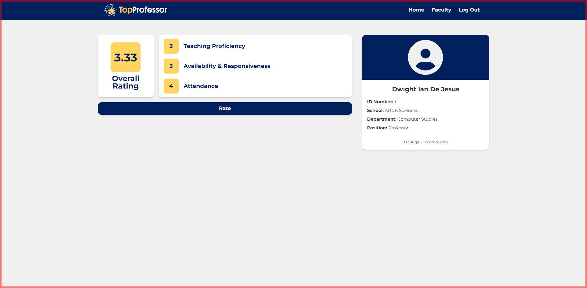
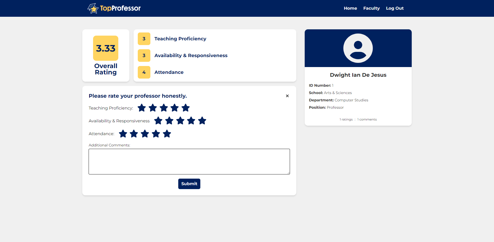
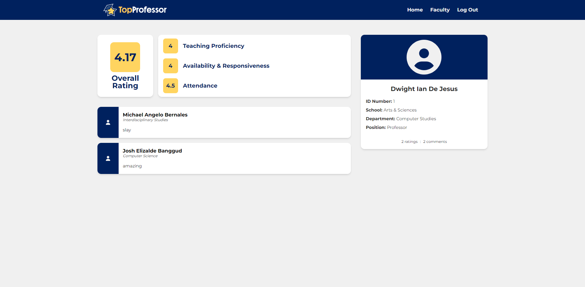
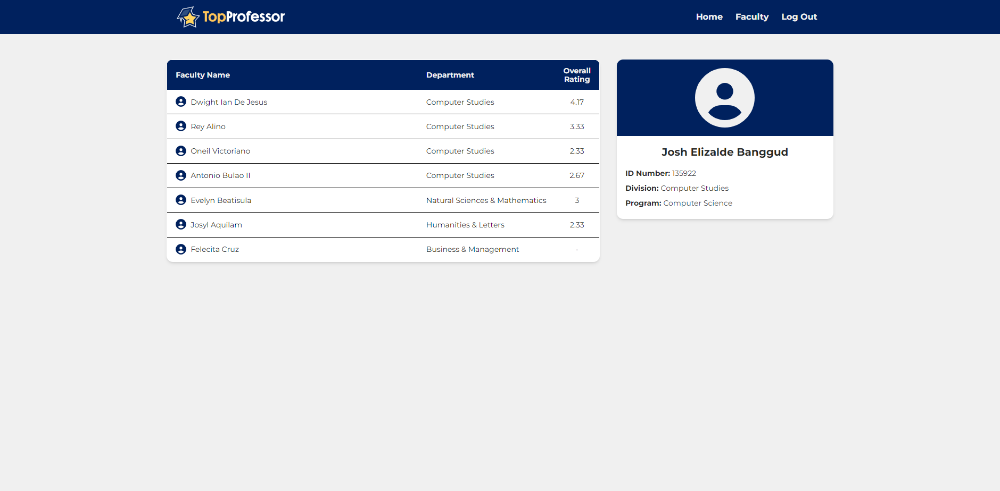
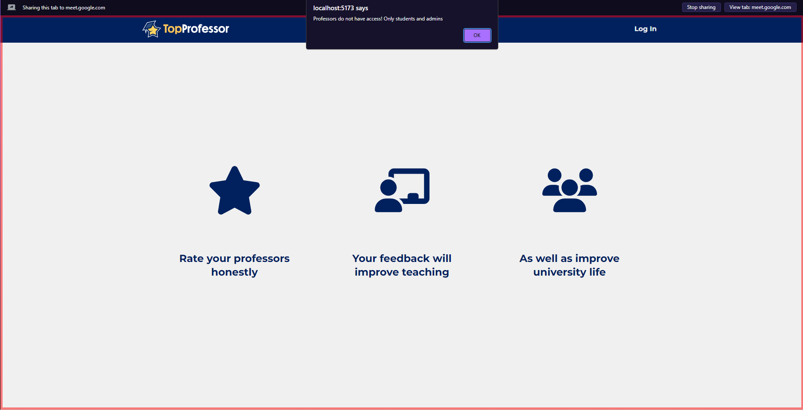
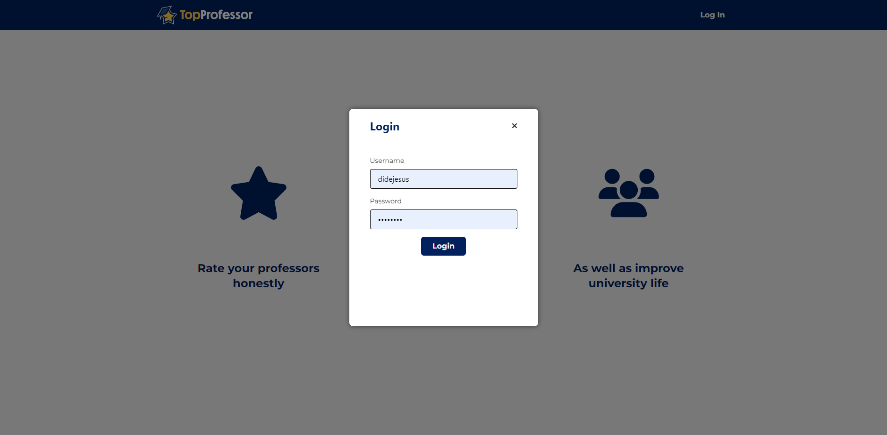
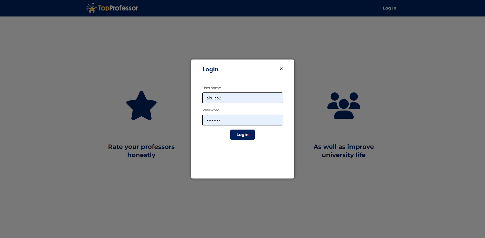
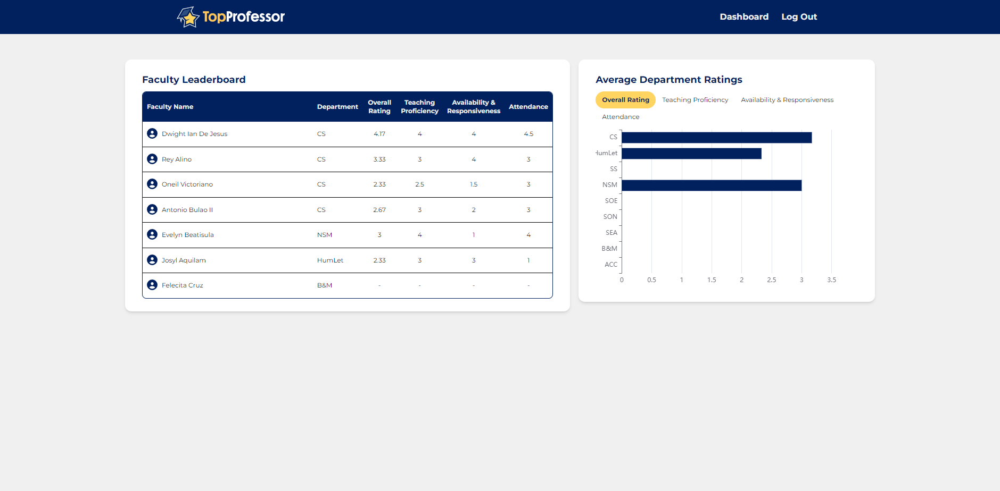
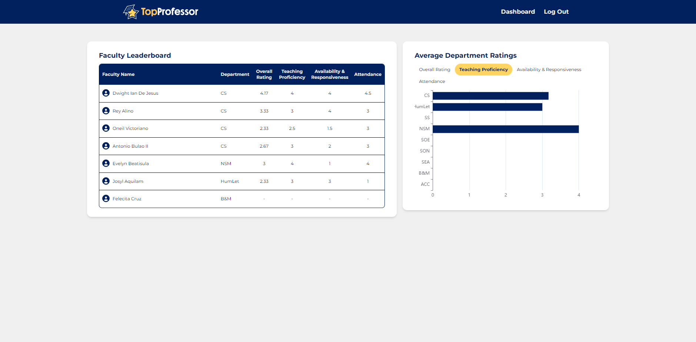
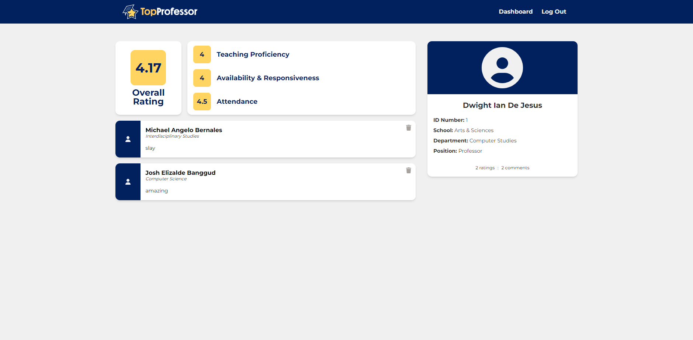

## Contributors:

- **Almonte, Dominic Miguel D.**
- **Banggud, Josh Elizalde A.**
- **Calio, Ethan Rey L.**

# Devnotes:

- **Database**: PostgreSQL
- **Web Framework**: Django REST
- **Frontend**: React

## Dependencies:
- **NodeJS** --> https://nodejs.org/en/download/current
- **Python** --> https://www.python.org/downloads/
- **PostgreSQL** --> https://www.enterprisedb.com/downloads/postgres-postgresql-downloads

## Controls:
- **Start(Backend)**: ``python .\manage.py runserver``
- **Start(Frontend)**: ``npm run dev``
- **End**: ``CTRL + C``

## Notes:
- When installing django, it might me useful to use the ``--user`` keyword: pip install --user djangorestframework
- If django-admin is not recognized due to not being in PATH, ``python -m django`` may be used

## Commands:
- ``python manage.py makemigrations`` --> check if there are migrations need for the models in django (./api/models.py)
- ``python manage.py migrate`` --> migrate changes for the models in django